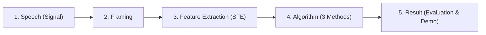

# Tài Liệu Kỹ Thuật & Kiến Thức Cốt Lõi (DSP VAD Documentation Hub)

Thư mục `docs/` chứa toàn bộ tài liệu học thuật, quy chế thi, đề bài và kiến thức nền tảng phục vụ cho bài toán **Phân đoạn tín hiệu tiếng nói và khoảng lặng (Speech/Silence Discrimination / VAD)** trong môn học Xử lý tín hiệu số (DSP).

---

## 1. Cấu Trúc Thư Mục `docs/`

```text
docs/
├── README.md                          # [Tài liệu hiện tại] Tổng quan & bản đồ tài liệu
├── guidelines/                        # Quy chế thi, yêu cầu đề bài và dữ liệu mẫu
│   ├── README.md                      # Tóm lược quy định nộp bài, slide & demo
│   ├── assignment_instructions_2026.docx # File Word đề tài chính thức từ Giảng viên
│   ├── presentation_rules.pdf         # Quy định trình bày slide và demo 4 phút
│   └── samples/                       # Đồ thị mẫu theo quy chuẩn của bài giảng
│       ├── sampleFigure.bmp
│       └── sampleFigure.eps
├── lectures/                          # Bài giảng chính khóa (GV Ninh Khánh Duy)
│   ├── README.md                      # Tóm tắt lý thuyết Chapter 6 (Đặc trưng miền thời gian & VAD)
│   └── Chapter6_SPEECH_SIGNAL_PROCESSING.pdf
└── theory/                            # Tài liệu lý thuyết bổ trợ & tiền xử lý âm thanh
    ├── README.md                      # Hướng dẫn chi tiết kỹ thuật: Framing, STE, 3 Thuật toán
    ├── 01_audio_signal_fundamentals.pdf   # Khái niệm cơ bản về tín hiệu âm thanh
    ├── 02_speech_processing_overview.pdf  # Tổng quan cơ chế phát âm và ngữ âm học
    ├── 03_data_preprocessing.pdf          # Kỹ thuật tiền xử lý (Windowing, Normalization)
    └── 04_feature_engineering.pdf         # Trích xuất đặc trưng âm thanh (STE, ZCR, MFCC)
```

---

## 2. Bản Đồ Tra Cứu Nhanh Theo Nhiệm Vụ

| Bạn cần tìm thông tin gì? | Tài liệu cần đọc |
| :--- | :--- |
| **Quy định làm slide & demo (3 phút slide, 1 phút demo, <= 7 dòng/slide)** | [`docs/guidelines/README.md`](guidelines/README.md) |
| **Yêu cầu chi tiết đề tài VAD, 3 thuật toán và quy tắc lọc 200ms** | [`docs/guidelines/assignment_instructions_2026.docx`](guidelines/assignment_instructions_2026.docx) |
| **Lý thuyết về STE, MA, Framing và phân đoạn tiếng nói/khoảng lặng** | [`docs/lectures/README.md`](lectures/README.md) |
| **Công thức toán học & cài đặt 3 thuật toán (Binary Search, Histogram, Gaussian)** | [`docs/theory/README.md`](theory/README.md) |
| **Tài liệu chuyên sâu về Thuật toán Thống kê Gauss & Lý thuyết Bayes** | [`docs/theory/gauss.md`](theory/gauss.md) |
| **Hình ảnh mẫu 4 đồ thị hiển thị ở 4 góc màn hình** | [`docs/guidelines/samples/sampleFigure.bmp`](guidelines/samples/sampleFigure.bmp) |

---

## 3. Kiến Trúc Pipeline Tiêu Chuẩn 5 Khối (Theo Giảng Viên)

Mọi mã nguồn và báo cáo đều phải tuân thủ nghiêm ngặt mô hình 5 khối nối tiếp:



1. **Khối 1 - Speech (signal):** Nạp file `.wav`, chuẩn hóa biên độ về khoảng $[-1, 1]$.
2. **Khối 2 - Framing:** Chia khung tín hiệu ngắn hạn ($20 - 30\text{ ms}$, dịch khung $10 - 15\text{ ms}$) kèm cửa sổ hóa (Hamming / Rectangular).
3. **Khối 3 - Feature extraction (STE):** Tính năng lượng ngắn hạn (Short-Time Energy - STE) hoặc độ lớn trung bình (Magnitude Average - MA), sau đó chuẩn hóa về $[0, 1]$.
4. **Khối 4 - Algorithm:** Áp dụng 3 thuật toán tìm ngưỡng:
   - *Thuật toán 1:* Tìm kiếm nhị phân (Binary Search).
   - *Thuật toán 2:* Phân tích biểu đồ tần suất (Histogram bimodal valley).
   - *Thuật toán 3:* Thống kê phân phối chuẩn (Gaussian Statistics & Bayes/Equal-std rule).
   - *Hậu xử lý:* Loại bỏ các khoảng lặng giả định có độ dài $< 200\text{ ms}$.
5. **Khối 5 - Result:** Vẽ biên phân đoạn tìm được (xanh) đối chiếu với Ground Truth (đỏ), tính sai số MAE/RMSE (ms), hiển thị 4 cửa sổ figure tại 4 góc màn hình.
