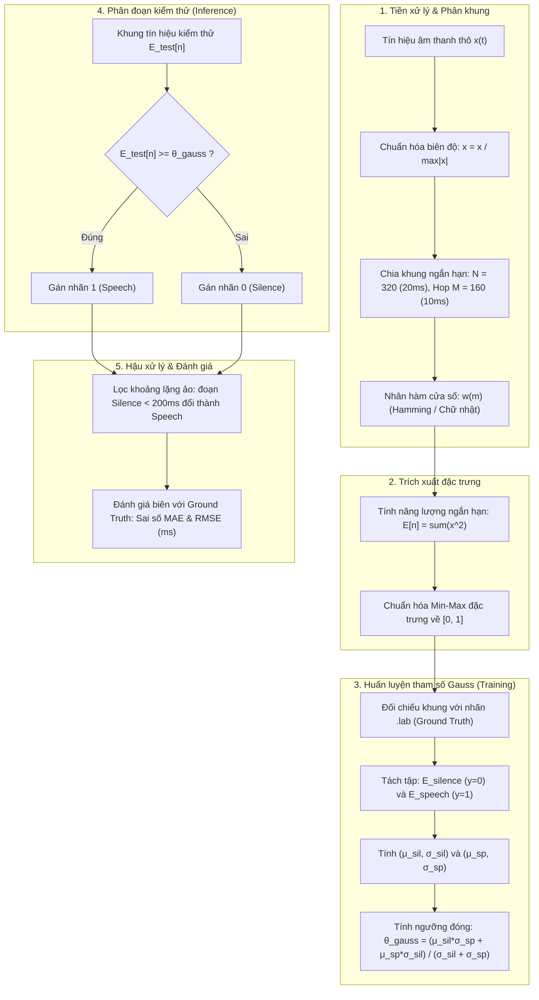
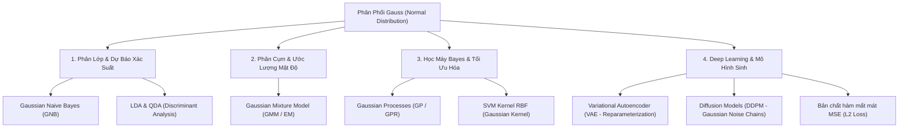

# Phương Pháp Thống Kê Phân Phối Chuẩn (Gaussian Statistics Thresholding) Trong Phân Đoạn Tiếng Nói & Khoảng Lặng (VAD)

---

## 1. Tổng Quan Bài Toán & Động Lực

Trong hệ thống xử lý tín hiệu tiếng nói (Speech Processing) và nhận dạng tiếng nói tự động (ASR), **Voice Activity Detection (VAD)** là module tiền xử lý tối quan trọng nhằm phân tách tín hiệu âm thanh thành hai trạng thái:

- **Tiếng nói (Speech - $C_1$ / Label 1):** Bao gồm cả âm hữu thanh (Voiced) và âm vô thanh (Unvoiced).
- **Khoảng lặng / Nhiễu nền (Silence - $C_0$ / Label 0):** Khoảng thời gian người nói ngừng phát âm, chỉ còn tạp âm môi trường hoặc nhiễu thiết bị.

Để thực hiện phân tách, ta trích xuất chuỗi đặc trưng năng lượng ngắn hạn (Short-Time Energy - STE). Bài toán quy về việc tìm một **ngưỡng quyết định tối ưu $\theta$ (Decision Threshold)** sao cho:

$$
\hat{y}[n] = \begin{cases} 1 \quad (\text{Speech}) & \text{nếu } E[n] \ge \theta \\ 0 \quad (\text{Silence}) & \text{nếu } E[n] < \theta \end{cases}
$$

**Phương pháp Gauss** tiếp cận bài toán dưới góc nhìn **nhận dạng mẫu tham số có giám sát (Parametric Supervised Pattern Classification)**: giả định năng lượng của từng trạng thái tuân theo phân phối chuẩn (Gaussian/Normal Distribution) độc lập, từ đó suy dẫn ngưỡng phân lớp tối ưu dựa trên lý thuyết quyết định xác suất.

---

## 2. Cơ Sở Lý Thuyết Xác Suất & Thống Kê

### 2.1. Phân Phối Chuẩn Đơn Biến (Univariate Gaussian Distribution)

Một biến ngẫu nhiên liên tục $X$ (đại diện cho năng lượng $E$ của một khung) tuân theo phân phối chuẩn $\mathcal{N}(\mu, \sigma^2)$ có hàm mật độ xác suất (Probability Density Function - PDF) xác định bởi:

$$
p(x; \mu, \sigma) = \frac{1}{\sigma \sqrt{2\pi}} \exp\left( -\frac{(x - \mu)^2}{2\sigma^2} \right)
$$

Trong đó:

- $\mu = \mathbb{E}[X]$: Kỳ vọng toán học (Mean) — thể hiện mức năng lượng tập trung trung tâm của lớp.
- $\sigma^2 = \text{Var}(X)$: Phương sai (Variance), và $\sigma$ là độ lệch chuẩn (Standard Deviation) — thể hiện độ biến động hoặc phân tán của năng lượng quanh giá trị trung tâm.

### 2.2. Mô Hình Hóa Hai Trạng Thái Tín Hiệu

Giả định rằng tập năng lượng ngắn hạn thuộc hai lớp phát sinh từ hai nguồn phân phối Gauss độc lập:

1. **Phân phối của Khoảng lặng / Nhiễu (Silence - $C_0$):**

   $$
   p(E \mid C_0) = \frac{1}{\sigma_{sil} \sqrt{2\pi}} \exp\left( -\frac{(E - \mu_{sil})^2}{2\sigma_{sil}^2} \right)
   $$

   *Đặc trưng:* $\mu_{sil}$ rất nhỏ (năng lượng nhiễu thấp), $\sigma_{sil}$ nhỏ (nhiễu nền tương đối ổn định).
2. **Phân phối của Tiếng nói (Speech - $C_1$):**

   $$
   p(E \mid C_1) = \frac{1}{\sigma_{sp} \sqrt{2\pi}} \exp\left( -\frac{(E - \mu_{sp})^2}{2\sigma_{sp}^2} \right)
   $$

   *Đặc trưng:* $\mu_{sp} \gg \mu_{sil}$ (năng lượng lớn), $\sigma_{sp} \gg \sigma_{sil}$ (biên độ dao động mạnh giữa nguyên âm năng lượng lớn và phụ âm năng lượng nhỏ).

```
   Mật độ p(E)
      ^
      |       Silence p(E|C0)
      |          /\
      |         /  \                    Speech p(E|C1)
      |        /    \                     /-------\
      |       /      \       θ           /         \
      +------+--------+------+----------+-----------+----> Năng lượng E
      0    μ_sil    σ_sil  θ_gauss     μ_sp        σ_sp
```

### 2.3. Ước Lượng Tham Số Bằng Cực Đại Hóa Hợp Lý (Maximum Likelihood Estimation - MLE)

Dựa vào tập huấn luyện có nhãn thời gian chuẩn ground truth (file `.lab`), các khung được phân thành hai tập con:

$$
\mathcal{E}_{sil} = \{ E_i \mid y_i = 0 \}, \quad |\mathcal{E}_{sil}| = N_0
$$

$$
\mathcal{E}_{sp} = \{ E_j \mid y_j = 1 \}, \quad |\mathcal{E}_{sp}| = N_1
$$

Theo nguyên lý Hợp lý cực đại (MLE) cho phân phối chuẩn, các ước lượng điểm không chệch cho kỳ vọng và phương sai mẫu được tính như sau:

$$
\hat{\mu}_{sil} = \frac{1}{N_0} \sum_{i=1}^{N_0} E_i, \qquad \hat{\sigma}_{sil} = \sqrt{\frac{1}{N_0} \sum_{i=1}^{N_0} (E_i - \hat{\mu}_{sil})^2}
$$

$$
\hat{\mu}_{sp} = \frac{1}{N_1} \sum_{j=1}^{N_1} E_j, \qquad \hat{\sigma}_{sp} = \sqrt{\frac{1}{N_1} \sum_{j=1}^{N_1} (E_j - \hat{\mu}_{sp})^2}
$$

---

## 3. Lý Thuyết Quyết Định Bayes & Thiết Lập Ngưỡng Tối Ưu

### 3.1. Tiêu Chuẩn Phân Lớp Bayes (Minimum Error Rate Classification)

Theo Định lý Bayes, xác suất hậu nghiệm (Posterior Probability) của lớp $C_k$ khi quan sát thấy năng lượng $E$ là:

$$
P(C_k \mid E) = \frac{p(E \mid C_k) P(C_k)}{p(E)}
$$

Quy tắc quyết định tối ưu nhằm tối thiểu hóa xác suất lỗi phân loại (Bayes Risk với hàm tổn thất đối xứng 0-1) quy định rằng:

$$
\text{Chọn } C_1 \text{ nếu } P(C_1 \mid E) > P(C_0 \mid E) \iff \frac{p(E \mid C_1)}{p(E \mid C_0)} > \frac{P(C_0)}{P(C_1)}
$$

Giả định xác suất tiên nghiệm của hai lớp là xấp xỉ ngang nhau ($P(C_0) \approx P(C_1)$), điều kiện ranh giới phân định (Decision Boundary) tại ngưỡng $\theta$ là nghiệm của phương trình:

$$
p(\theta \mid C_0) = p(\theta \mid C_1)
$$

Thay biểu thức mật độ Gauss vào:

$$
\frac{1}{\sigma_{sil} \sqrt{2\pi}} \exp\left( -\frac{(\theta - \mu_{sil})^2}{2\sigma_{sil}^2} \right) = \frac{1}{\sigma_{sp} \sqrt{2\pi}} \exp\left( -\frac{(\theta - \mu_{sp})^2}{2\sigma_{sp}^2} \right)
$$

Lấy logarit tự nhiên hai vế:

$$
-\ln(\sigma_{sil}) - \frac{(\theta - \mu_{sil})^2}{2\sigma_{sil}^2} = -\ln(\sigma_{sp}) - \frac{(\theta - \mu_{sp})^2}{2\sigma_{sp}^2}
$$

$$
\iff \left( \frac{1}{\sigma_{sil}^2} - \frac{1}{\sigma_{sp}^2} \right) \theta^2 - 2 \left( \frac{\mu_{sil}}{\sigma_{sil}^2} - \frac{\mu_{sp}}{\sigma_{sp}^2} \right) \theta + \left( \frac{\mu_{sil}^2}{\sigma_{sil}^2} - \frac{\mu_{sp}^2}{\sigma_{sp}^2} - 2\ln\frac{\sigma_{sp}}{\sigma_{sil}} \right) = 0
$$

Phương trình bậc hai này cho hai nghiệm hình học. Nghiệm vật lý hợp lệ là điểm nằm xen kẽ giữa hai kỳ vọng: $\mu_{sil} < \theta < \mu_{sp}$.

---

### 3.2. Quy Tắc Khoảng Cách Độ Lệch Chuẩn Tương Đương (Equal Standard Deviation Distance Rule)

Trong thực nghiệm xử lý tín hiệu thực tế (đặc biệt khi dữ liệu năng lượng đã chuẩn hóa hoặc tỉ lệ phương sai lớn), việc giải phương trình bậc hai có thể dẫn tới nghiệm kỳ dị hoặc nhạy cảm với đuôi phân phối. Một dạng nghiệm xấp xỉ bền vững (robust approximation) được sử dụng rộng rãi là **Quy tắc cân bằng khoảng cách chuẩn hóa (Normalized Distance Equivalence)**:

Tìm $\theta$ sao cho khoảng cách tính bằng số lần độ lệch chuẩn từ $\theta$ về $\mu_{sil}$ bằng khoảng cách từ $\theta$ lên $\mu_{sp}$:

$$
\frac{\theta - \mu_{sil}}{\sigma_{sil}} = \frac{\mu_{sp} - \theta}{\sigma_{sp}}
$$

Nhân chéo và rút gọn đại số:

$$
\sigma_{sp} (\theta - \mu_{sil}) = \sigma_{sil} (\mu_{sp} - \theta)
$$

$$
\theta (\sigma_{sil} + \sigma_{sp}) = \mu_{sil} \sigma_{sp} + \mu_{sp} \sigma_{sil}
$$

$$
\implies \mathbf{\theta_{gauss} = \frac{\mu_{sil} \sigma_{sp} + \mu_{sp} \sigma_{sil}}{\sigma_{sil} + \sigma_{sp}}}
$$

#### Ý Nghĩa Vật Lý Của Trọng Số:

- Công thức trên thực chất là **trung bình có trọng số** giữa $\mu_{sil}$ và $\mu_{sp}$, nhưng nghịch đảo với độ phân tán:
  $$
  \theta_{gauss} = \frac{\frac{\mu_{sil}}{\sigma_{sil}} + \frac{\mu_{sp}}{\sigma_{sp}}}{\frac{1}{\sigma_{sil}} + \frac{1}{\sigma_{sp}}}
  $$
- **Trường hợp phương sai bằng nhau ($\sigma_{sil} = \sigma_{sp}$):** Ngưỡng rơi đúng vào trung điểm hình học: $\theta = \frac{\mu_{sil} + \mu_{sp}}{2}$.
- **Trường hợp thực tế ($\sigma_{sil} \ll \sigma_{sp}$):** Vì nhiễu nền ổn định ($\sigma_{sil}$ nhỏ), hệ số nhân với $\mu_{sp}$ là $\sigma_{sil}$ rất bé; trong khi hệ số nhân với $\mu_{sil}$ là $\sigma_{sp}$ lại rất lớn. Kết quả là ngưỡng $\theta_{gauss}$ bị kéo sát về phía $\mu_{sil}$. Điều này mang ý nghĩa phòng vệ cực tốt: **hạn chế tối đa việc bỏ sót các âm vị vô thanh có năng lượng yếu** của tiếng nói.

---

## 4. Quy Trình 5 Bước Áp Dụng Thuật Toán Trong Pipeline VAD

Toàn bộ quy trình từ âm thanh thô đến kết quả phân đoạn tuân thủ mô hình sau:



### Bước 1: Tiền xử lý & Chia khung (Framing & Windowing)

- Do tính chất dừng cục bộ (quasi-stationary) của âm thanh lời nói, khung được chọn trong khoảng $20\text{ ms} - 30\text{ ms}$.
- Ví dụ tần số lấy mẫu $F_s = 16000\text{ Hz}$, độ dài khung $N = 320$ mẫu ($20\text{ ms}$), bước nhảy $M = 160$ mẫu ($10\text{ ms}$).

### Bước 2: Tính năng lượng ngắn hạn (Short-Time Energy - STE)

- Năng lượng của khung thứ $n$:
  $$
  E[n] = \sum_{m=0}^{N-1} [x(n \cdot M + m) \cdot w(m)]^2
  $$
- Chuẩn hóa Min-Max đưa miền giá trị về đoạn $[0, 1]$:
  $$
  E_{norm}[n] = \frac{E[n] - \min(E)}{\max(E) - \min(E)}
  $$

### Bước 3: Ước lượng tham số & Xác định ngưỡng $\theta_{gauss}$

- Tận dụng 4 file huấn luyện (`phone_M1.wav`, `phone_F1.wav`, `studio_M1.wav`, `studio_F1.wav`), trích xuất toàn bộ $E_{norm}[n]$ cùng nhãn tương ứng.
- Tính toán bộ tham số $(\mu_{sil}, \sigma_{sil}, \mu_{sp}, \sigma_{sp})$.
- Tính $\theta_{gauss}$.

### Bước 4: Suy luận nhãn cho file kiểm thử

- So sánh từng khung $E_{test}[n]$ với $\theta_{gauss}$.

### Bước 5: Hậu xử lý loại bỏ khoảng lặng ngắn ($< 200\text{ ms}$)

- Trong cấu âm học, các âm tắc (plosives như /p/, /t/, /k/) tạo ra các khoảng nén khí ngắt hơi ngắn ($20 - 80\text{ ms}$). Việc phân đoạn máy móc thuần túy sẽ cắt đứt câu nói.
- Quy tắc bắt buộc: Mọi chuỗi liên tiếp các khung Silence có tổng thời gian $< 0.2\text{ s}$ ($200\text{ ms}$) đều phải được chuyển đổi thành Speech.

---

## 5. Cài Đặt Thực Tế Trong Mã Nguồn

Hàm tìm ngưỡng Gauss được triển khai tại module [`src/segmentation/thresholds.py`](file:///home/phuqy/Develop/Digital-Signal-Processing/gk/src/segmentation/thresholds.py#L107-L141):

```python
import numpy as np
from typing import Union, List, Tuple

def find_threshold_gaussian(
    speech_features_or_list: Union[np.ndarray, List[np.ndarray]],
    silence_features_or_labels: Union[np.ndarray, List[np.ndarray]],
) -> Union[float, Tuple[float, float, float, float, float]]:
    """Thuật toán 3: Thống kê tham số Gauss của Speech/Silence và tìm ngưỡng tối ưu.

    Áp dụng quy tắc khoảng cách độ lệch chuẩn tương đương (Equal-std distance):
        (θ - μ_sil) / σ_sil = (μ_sp - θ) / σ_sp
        => θ_opt = (μ_sil * σ_sp + μ_sp * σ_sil) / (σ_sil + σ_sp)
    """
    # Trường hợp 1: Nhận trực tiếp hai mảng năng lượng đã phân lớp
    if isinstance(speech_features_or_list, np.ndarray) and isinstance(silence_features_or_labels, np.ndarray):
        sp_feats = speech_features_or_list
        sil_feats = silence_features_or_labels

        mean_sil = float(np.mean(sil_feats)) if len(sil_feats) > 0 else 0.001
        std_sil = float(np.std(sil_feats)) if len(sil_feats) > 0 else 0.001
        mean_sp = float(np.mean(sp_feats)) if len(sp_feats) > 0 else 0.1
        std_sp = float(np.std(sp_feats)) if len(sp_feats) > 0 else 0.05

        if np.isclose(std_sil + std_sp, 0.0):
            return float((mean_sil + mean_sp) / 2.0)
        return float((mean_sil * std_sp + mean_sp * std_sil) / (std_sil + std_sp))

    # Trường hợp 2: Nhận danh sách các mảng đặc trưng và mảng nhãn tương ứng (từ tập train)
    all_feats = np.concatenate(speech_features_or_list)
    all_lbls = np.concatenate(silence_features_or_labels)

    sil_feats = all_feats[all_lbls == 0]
    sp_feats = all_feats[all_lbls == 1]

    mean_sil = float(np.mean(sil_feats)) if len(sil_feats) > 0 else 0.001
    std_sil = float(np.std(sil_feats)) if len(sil_feats) > 0 else 0.001
    mean_sp = float(np.mean(sp_feats)) if len(sp_feats) > 0 else 0.1
    std_sp = float(np.std(sp_feats)) if len(sp_feats) > 0 else 0.05

    if np.isclose(std_sil + std_sp, 0.0):
        t_opt = (mean_sil + mean_sp) / 2.0
    else:
        t_opt = (mean_sil * std_sp + mean_sp * std_sil) / (std_sil + std_sp)

    return float(t_opt), mean_sil, std_sil, mean_sp, std_sp
```

---

## 6. Đánh Giá Toàn Diện: Ưu Điểm, Nhược Điểm & Hướng Mở Rộng

### 6.1. Bảng So Sánh 3 Thuật Toán Trong Bài Toán VAD

| Thuật toán                                        | Bản chất                       | Độ phức tạp                                                                                                                                                                                                                                                                                       | Ưu điểm cốt lõi                                                                                           | Nhược điểm cốt lõi                                                                              |
| :-------------------------------------------------- | :------------------------------- | :---------------------------------------------------------------------------------------------------------------------------------------------------------------------------------------------------------------------------------------------------------------------------------------------------- | :------------------------------------------------------------------------------------------------------------- | :---------------------------------------------------------------------------------------------------- |
| **Tìm kiếm nhị phân (Binary Search)**     | Giám sát (Supervised)          | $\mathcal{O}(K \cdot N)$ với $K$ bước tìm kiếm                                                                                                                                                                                                                                               | Tối ưu trực tiếp trên hàm mục tiêu (F1-score / Accuracy).                                              | Tốn chi phí tính toán hơn, dễ overfit vào tập nhãn huấn luyện.                             |
| **Biểu đồ tần suất (Histogram Bimodal)** | Không giám sát (Unsupervised) | $\mathcal{O}(N + B)$ với $B$ bins                  | Không cần nhãn ground truth, phản ánh trực tiếp phân bố năng lượng mẫu.                           | Dễ thất bại nếu phân bố không rõ 2 đỉnh (tín hiệu quá ồn, SNR thấp) hoặc chọn sai kích thước bin$B$. |                                                                                                                |                                                                                                       |
| **Thống kê Gauss (Gaussian Thresholding)**  | Giám sát tham số (Parametric) | $\mathcal{O}(N)$ (1 lượt duyệt tính mean, std)                                                                                                                                                                                                                                                  | **Tốc độ cực nhanh**, dạng công thức nghiệm đóng, cân nhắc cả độ biến động $\sigma$. | Giả định phân phối chuẩn có thể bị chệch nếu năng lượng có phân phối lệch (skewed). |

### 6.2. Hướng Mở Rộng Học Thuật (Advanced Extensions)

1. **Gaussian Mixture Model (GMM):**
   Trong thực tế, tiếng nói gồm nhiều nguyên âm mạnh và phụ âm yếu nên phân phối của nó không phải là một đỉnh Gauss đơn lẻ mà là đa đỉnh. Mô hình hỗn hợp Gauss (GMM) mô tả $p(E \mid \text{Speech}) = \sum_{k=1}^K w_k \mathcal{N}(\mu_k, \sigma_k^2)$ giúp phân định chính xác hơn nhiều.
2. **Adaptive Gaussian Thresholding (Ước lượng thích nghi online):**
   Đối với môi trường thời gian thực (nhiễu động như tiếng xe cộ, quạt gió thay đổi), các tham số $(\mu_{sil}, \sigma_{sil})$ liên tục được cập nhật đệ quy theo thời gian thông qua các khung được xác định là Silence:
   $$
   \mu_{sil}[t] = \alpha \mu_{sil}[t-1] + (1 - \alpha) E[t]
   $$
3. **Mô hình VAD thống kê Sohn (Statistical Model-based VAD):**
   Mô hình kinh điển của Sohn et al. (1999) sử dụng giả thiết phân phối Gauss đa biến trên các thành phần phổ tần số rời rạc (DFT coefficients), sử dụng kiểm định tỉ số hợp lý (Likelihood Ratio Test - LRT).

---

## 7. Ứng Dụng Của Phân Phối Gauss Trong Machine Learning & Deep Learning

Trong khoa học dữ liệu và học máy hiện đại, phân phối Gauss đóng vai trò nền tảng cả về mặt lý thuyết thông tin lẫn thuật toán thực thi nhờ **Định lý giới hạn trung tâm (Central Limit Theorem)** và tính chất giải tích đối xứng, khép kín qua các phép biến đổi tuyến tính.



---

### 7.1. Phân Loại Bayes Ngây Thơ Gauss (Gaussian Naive Bayes - GNB)

Khi bài toán phân đoạn tiếng nói hoặc phân lớp dữ liệu được mở rộng từ 1 đặc trưng ($E$) sang vector đặc trưng $D$ chiều $\mathbf{x} = [x_1, x_2, \dots, x_D]^T$ (ví dụ: kết hợp STE, Zero Crossing Rate - ZCR, Spectral Centroid, MFCCs):

- **Giả định ngây thơ (Conditional Independence):** Các đặc trưng độc lập thống kê với nhau khi biết nhãn lớp $C_k$:

  $$
  p(\mathbf{x} \mid C_k) = \prod_{d=1}^D p(x_d \mid C_k)
  $$
- **Mô hình hóa Gauss từng chiều:**

  $$
  p(x_d \mid C_k) = \frac{1}{\sigma_{kd} \sqrt{2\pi}} \exp\left( -\frac{(x_d - \mu_{kd})^2}{2\sigma_{kd}^2} \right)
  $$
- **Quy tắc phân lớp:**

  $$
  \hat{y} = \arg\max_{k} \left[ \ln P(C_k) - \sum_{d=1}^D \ln(\sigma_{kd}) - \sum_{d=1}^D \frac{(x_d - \mu_{kd})^2}{2\sigma_{kd}^2} \right]
  $$

  > **Liên hệ với bài toán VAD:** Thuật toán Gauss trong VAD chính là trường hợp suy biến đơn biến ($D = 1$) của Gaussian Naive Bayes với đặc trưng duy nhất là Short-Time Energy.
  >

---

### 7.2. Phân Tích Biệt Số Tuyến Tính & Toàn Phương (LDA & QDA)

Khi không giả định các đặc trưng độc lập mà tương quan với nhau, dữ liệu lớp $C_k$ được mô hình hóa bằng **Phân phối chuẩn đa biến (Multivariate Normal Distribution)**:

$$
p(\mathbf{x} \mid C_k) = \frac{1}{(2\pi)^{D/2} |\boldsymbol{\Sigma}_k|^{1/2}} \exp\left( -\frac{1}{2} (\mathbf{x} - \boldsymbol{\mu}_k)^T \boldsymbol{\Sigma}_k^{-1} (\mathbf{x} - \boldsymbol{\mu}_k) \right)
$$

Trong đó $\boldsymbol{\mu}_k \in \mathbb{R}^D$ là vector kỳ vọng, $\boldsymbol{\Sigma}_k \in \mathbb{R}^{D \times D}$ là ma trận hiệp phương sai (Covariance Matrix).

1. **Quadratic Discriminant Analysis (QDA):**
   - Giả định mỗi lớp có ma trận hiệp phương sai riêng biệt $\boldsymbol{\Sigma}_k \ne \boldsymbol{\Sigma}_j$.
   - Hàm biệt số chứa thành phần bậc hai $\mathbf{x}^T \boldsymbol{\Sigma}_k^{-1} \mathbf{x}$, tạo ra **mặt phân chia bậc hai** (elip, parabol, hyperbol).
   - Đây chính là dạng tổng quát hóa nhiều chiều của phương trình bậc hai Bayes trong Mục 3.1 của bài toán VAD.
2. **Linear Discriminant Analysis (LDA):**
   - Giả định tất cả các lớp dùng chung ma trận hiệp phương sai $\boldsymbol{\Sigma}_k = \boldsymbol{\Sigma}$.
   - Khi đó các thành phần bậc hai $\mathbf{x}^T \boldsymbol{\Sigma}^{-1} \mathbf{x}$ ở hai vế triệt tiêu lẫn nhau, phương trình ranh giới suy biến thành **siêu phẳng tuyến tính bậc một (Hyperplane)**:
     $$
     \mathbf{w}^T \mathbf{x} + w_0 = 0, \quad \text{với } \mathbf{w} = \boldsymbol{\Sigma}^{-1}(\boldsymbol{\mu}_1 - \boldsymbol{\mu}_0)
     $$

---

### 7.3. Mô Hình Hỗn Hợp Gauss (Gaussian Mixture Models - GMM) & Thuật Toán EM

Trong nhiều bài toán thực tế, phân phối dữ liệu của một lớp không phải là đơn đỉnh mà phức tạp, phi đối xứng hoặc có nhiều cụm con. Theo định lý xấp xỉ, **mọi hàm mật độ xác suất liên tục trơn đều có thể được xấp xỉ với độ chính xác tùy ý bằng một tổ hợp tuyến tính các hàm Gauss**:

$$
p(\mathbf{x}) = \sum_{k=1}^K \pi_k \mathcal{N}(\mathbf{x} \mid \boldsymbol{\mu}_k, \boldsymbol{\Sigma}_k)
$$

Với điều kiện ràng buộc xác suất: $\sum_{k=1}^K \pi_k = 1$ và $\pi_k \ge 0$.

#### Thuật toán Kỳ vọng - Cực đại hóa (Expectation-Maximization - EM):

Do có biến ẩn (latent variable biểu thị điểm dữ liệu thuộc thành phần Gauss nào), ta không thể giải MLE trực tiếp mà dùng EM:

1. **E-step (Expectation):** Tính xác suất trách nhiệm (Responsibility) mà thành phần thứ $k$ sinh ra điểm $\mathbf{x}_i$:
   $$
   \gamma_{ik} = \frac{\pi_k \mathcal{N}(\mathbf{x}_i \mid \boldsymbol{\mu}_k, \boldsymbol{\Sigma}_k)}{\sum_{j=1}^K \pi_j \mathcal{N}(\mathbf{x}_i \mid \boldsymbol{\mu}_j, \boldsymbol{\Sigma}_j)}
   $$
2. **M-step (Maximization):** Cập nhật lại các tham số dựa trên trọng số mềm $\gamma_{ik}$:
   $$
   N_k = \sum_{i=1}^N \gamma_{ik}, \quad \boldsymbol{\mu}_k^{new} = \frac{1}{N_k} \sum_{i=1}^N \gamma_{ik} \mathbf{x}_i, \quad \boldsymbol{\Sigma}_k^{new} = \frac{1}{N_k} \sum_{i=1}^N \gamma_{ik} (\mathbf{x}_i - \boldsymbol{\mu}_k^{new})(\mathbf{x}_i - \boldsymbol{\mu}_k^{new})^T, \quad \pi_k^{new} = \frac{N_k}{N}
   $$

> **Ứng dụng kinh điển:** Hệ thống nhận dạng giọng nói GMM-HMM (HTK, Kaldi toolkit), phân cụm người nói (Speaker Diarization) và khử nhiễu phổ âm thanh.

---

### 7.4. Quá Trình Gauss (Gaussian Processes - GP) & Tối Ưu Hóa Bayes

Khác với học máy tham số truyền thống (học vector trọng số $\mathbf{w}$), **Gaussian Process** là phương pháp Bayes phi tham số định nghĩa một phân phối xác suất trên toàn bộ **không gian các hàm số**:

$$
f(\mathbf{x}) \sim \mathcal{GP}\left(m(\mathbf{x}), k(\mathbf{x}, \mathbf{x}')\right)
$$

- $m(\mathbf{x}) = \mathbb{E}[f(\mathbf{x})]$: Hàm kỳ vọng (thường gán bằng 0).
- $k(\mathbf{x}, \mathbf{x}')$: Hàm hiệp phương sai (Kernel function), phổ biến nhất là **Radial Basis Function (RBF / Squared Exponential Kernel)**:
  $$
  k(\mathbf{x}, \mathbf{x}') = \sigma_f^2 \exp\left( -\frac{\|\mathbf{x} - \mathbf{x}'\|^2}{2\ell^2} \right)
  $$

#### Đặc tính vượt trội trong ML:

- Khi quan sát tập dữ liệu $\mathcal{D} = \{(\mathbf{x}_i, y_i)\}$, phân phối dự báo tại điểm mới $\mathbf{x}_*$ là một phân phối chuẩn hoàn toàn khép kín:
  $$
  f_* \mid \mathcal{D}, \mathbf{x}_* \sim \mathcal{N}(\mu_*, \sigma_*^2)
  $$
- Không chỉ cho ra giá trị dự đoán trung bình $\mu_*$, GP còn cung cấp **độ bất định (Uncertainty $\sigma_*^2$)** của mô hình.
- **Ứng dụng:** Trụ cột của **Tối ưu hóa Bayes (Bayesian Optimization)** dùng để tự động tìm kiếm siêu tham số tối ưu (Hyperparameter Tuning) cho mạng nơ-ron sâu hoặc các thí nghiệm đắt đỏ.

---

### 7.5. Hàm Nhân Gauss (RBF Kernel) Trong Support Vector Machines (SVM)

Trong thuật toán SVM phân loại phi tuyến, dữ liệu ở không gian gốc không thể phân tách tuyến tính. Thông qua hàm nhân Gauss (RBF Kernel):

$$
K(\mathbf{x}, \mathbf{x}') = \exp\left(-\gamma \|\mathbf{x} - \mathbf{x}'\|^2\right)
$$

- Dựa trên khai triển chuỗi Taylor của hàm mũ:
  $$
  \exp\left(-\gamma \|\mathbf{x} - \mathbf{x}'\|^2\right) = \sum_{n=0}^{\infty} \frac{(2\gamma)^n}{n!} (\mathbf{x}^T \mathbf{x}')^n \exp(-\gamma \|\mathbf{x}\|^2) \exp(-\gamma \|\mathbf{x}'\|^2)
  $$
- Hàm nhân Gauss ngầm định ánh xạ các điểm dữ liệu vào một **Không gian Hilbert vô hạn chiều (Infinite-dimensional RKHS)**, cho phép đường biên quyết định phức tạp tùy ý mà không bị bùng nổ chi phí tính toán trực tiếp.

---

### 7.6. Phân Phối Gauss Trong Deep Learning & Generative AI

```
1. Regression Loss:     y = f(x) + ε,  ε ~ N(0, σ^2)   ==>  Loss = MSE (L2)
2. Variational AE:      z = μ(x) + σ(x) ⊙ ε, ε ~ N(0, I) ==>  KL-Divergence penalty
3. Diffusion (DDPM):    q(x_t | x_{t-1}) = N(x_t; √(1-β_t) x_{t-1}, β_t I)
```

#### 1. Bản chất xác suất của hàm mất mát sai số bình phương trung bình (MSE Loss):

Trong bài toán hồi quy (Regression), việc huấn luyện mạng nơ-ron với hàm mất mát MSE:

$$
\mathcal{L}_{MSE} = \frac{1}{N} \sum_{i=1}^N (y_i - f_\theta(\mathbf{x}_i))^2
$$

thực chất tương đương chính xác với bài toán **Hợp lý cực đại (MLE)** khi giả định rằng sai số đầu ra $\epsilon$ tuân theo phân phối chuẩn độc lập cùng phân phối: $y = f_\theta(\mathbf{x}) + \epsilon$, với $\epsilon \sim \mathcal{N}(0, \sigma^2)$.

#### 2. Mạng Tự Mã Hóa Biến Phân (Variational Autoencoder - VAE):

- Để không gian ẩn (Latent space $\mathbf{z}$) trơn tru và có thể sinh mẫu mới, VAE ép phân phối tiên nghiệm của không gian ẩn về phân phối chuẩn chuẩn tắc: $p(\mathbf{z}) = \mathcal{N}(\mathbf{0}, \mathbf{I})$.
- Encoder dự đoán ra hai vector tham số: vector trung bình $\boldsymbol{\mu}_\mathbf{x}$ và vector độ lệch log-phương sai $\ln(\boldsymbol{\sigma}_\mathbf{x}^2)$.
- Khoảng cách Kullback-Leibler (KL Divergence) giữa phân phối ẩn và phân phối chuẩn tắc có nghiệm giải tích dạng đóng:

  $$
  \mathcal{D}_{KL}\left(\mathcal{N}(\boldsymbol{\mu}, \text{diag}(\boldsymbol{\sigma}^2)) \parallel \mathcal{N}(\mathbf{0}, \mathbf{I})\right) = -\frac{1}{2} \sum_{j=1}^J \left( 1 + \ln(\sigma_j^2) - \mu_j^2 - \sigma_j^2 \right)
  $$
- **Thủ thuật tái tham số hóa (Reparameterization Trick):** Vì phép lấy mẫu ngẫu nhiên $\mathbf{z} \sim \mathcal{N}(\boldsymbol{\mu}, \boldsymbol{\Sigma})$ làm đứt dòng truyền gradient, ta tách tính ngẫu nhiên ra khỏi đồ thị tính toán:

  $$
  \mathbf{z} = \boldsymbol{\mu} + \boldsymbol{\sigma} \odot \boldsymbol{\epsilon}, \quad \text{với } \boldsymbol{\epsilon} \sim \mathcal{N}(\mathbf{0}, \mathbf{I})
  $$

  giúp gradient lan truyền ngược (Backpropagation) trực tiếp qua $\boldsymbol{\mu}$ và $\boldsymbol{\sigma}$.

#### 3. Mô Hình Khuếch Tán Xác Suất (Denoising Diffusion Probabilistic Models - DDPM):

Mô hình sinh ảnh hàng đầu hiện nay (Stable Diffusion, Imagen) hoạt động hoàn toàn dựa trên xích Markov Gauss:

- **Quá trình khuếch tán xuôi (Forward Process):** Từng bước hủy hoại cấu trúc bức ảnh bằng cách cộng nhiễu Gauss:

  $$
  q(\mathbf{x}_t \mid \mathbf{x}_{t-1}) = \mathcal{N}\left(\mathbf{x}_t; \sqrt{1 - \beta_t} \mathbf{x}_{t-1}, \beta_t \mathbf{I}\right)
  $$

  Nhờ tính chất cuộn của phân phối Gauss, ta có thể lấy mẫu trực tiếp ở bước $t$ bất kỳ:

  $$
  q(\mathbf{x}_t \mid \mathbf{x}_0) = \mathcal{N}\left(\mathbf{x}_t; \sqrt{\bar{\alpha}_t} \mathbf{x}_0, (1 - \bar{\alpha}_t) \mathbf{I}\right)
  $$
- **Quá trình khuếch tán ngược (Reverse Process):** Mạng nơ-ron (thường là U-Net) học cách đảo ngược quá trình trên bằng cách ước lượng trung bình và phương sai của nhiễu Gauss để tái tạo ảnh từ nhiễu trắng thuần túy.

---

## 8. Tài Liệu Tham Khảo (Citations & References)

Dưới đây là các tài liệu học thuật và giáo trình kinh điển được trích dẫn trực tiếp làm nền tảng khoa học:

### Tài liệu Xử lý Tín hiệu & VAD

1. **L. R. Rabiner and R. W. Schafer (1978)**, *Digital Processing of Speech Signals*, Prentice-Hall, Inc., Englewood Cliffs, New Jersey.
   - *Tham chiếu:* Chương 4: "Time-Domain Methods for Speech Processing", Mục 4.2 (Short-Time Energy) và Mục 4.6 (Voiced-Unvoiced-Silence Classification).
2. **B. S. Atal and L. R. Rabiner (1976)**, *"A Pattern-Recognition Approach to Voiced-Unvoiced-Silence Classification with Applications to Speech Recognition"*, *IEEE Transactions on Acoustics, Speech, and Signal Processing*, vol. ASSP-24, no. 3, pp. 201–212.
   - *Tham chiếu:* Đặt nền móng cho việc sử dụng phân phối thống kê năng lượng và các đặc trưng miền thời gian kết hợp mẫu xác suất để phân định tiếng nói và khoảng lặng.
3. **J. Sohn, N. S. Kim, and W. Sung (1999)**, *"A statistical model-based voice activity detection"*, *IEEE Signal Processing Letters*, vol. 6, no. 1, pp. 1–3.
   - *Tham chiếu:* Công trình đặt chuẩn mực cho hướng tiếp cận kiểm định giả thuyết thống kê Gauss trong bài toán VAD.
4. **ThS. Ninh Khánh Duy (2026)**, *Bài giảng Xử lý tín hiệu tiếng nói (Speech Signal Processing)*, Chương 6: "Các đặc trưng miền thời gian và kỹ thuật phân đoạn tiếng nói/khoảng lặng", Bộ môn Xử lý tín hiệu số, Trường Đại học Bách Khoa / Đại học Quốc gia.
   - *Tham chiếu:* Cấu trúc pipeline 5 khối, công thức phân khung, chuẩn hóa STE, quy tắc hậu xử lý lọc khoảng lặng $200\text{ ms}$, và phương pháp đánh giá sai số MAE/RMSE.

### Tài liệu Học Máy & Trí Tuệ Nhân Tạo (Machine Learning & AI)

5. **Richard O. Duda, Peter E. Hart, and David G. Stork (2001)**, *Pattern Classification*, 2nd Edition, John Wiley & Sons, New York.
   - *Tham chiếu:* Chương 2: "Bayesian Decision Theory", Mục 2.1–2.6 (Lý thuyết quyết định Bayes, Maximum Likelihood, LDA và QDA cho phân phối chuẩn đa biến).
6. **Christopher M. Bishop (2006)**, *Pattern Recognition and Machine Learning*, Springer, New York.
   - *Tham chiếu:* Mục 1.2 (Probability Theory), Mục 2.3 (The Gaussian Distribution), Mục 4.2 (Probabilistic Generative Models - LDA/QDA), Chương 9 (Mixture Models & EM algorithm).
7. **Kevin P. Murphy (2012)**, *Machine Learning: A Probabilistic Perspective*, MIT Press, Cambridge, Massachusetts.
   - *Tham chiếu:* Chương 3 (Generative Models for Discrete & Continuous Data), Chương 4 (Gaussian Models), Chương 11 (Mixture Models).
8. **C. E. Rasmussen and C. K. I. Williams (2006)**, *Gaussian Processes for Machine Learning*, MIT Press.
   - *Tham chiếu:* Chương 2: "Regression" (Cơ sở toán học của Gaussian Process Regression và hàm nhân RBF).
9. **Diederik P. Kingma and Max Welling (2014)**, *"Auto-Encoding Variational Bayes"*, *Proceedings of the 2nd International Conference on Learning Representations (ICLR)*.
   - *Tham chiếu:* Đề xuất kiến trúc Variational Autoencoder (VAE) và kỹ thuật Reparameterization Trick trên phân phối chuẩn.
10. **Jonathan Ho, Ajay Jain, and Pieter Abbeel (2020)**, *"Denoising Diffusion Probabilistic Models"*, *Advances in Neural Information Processing Systems (NeurIPS)*, vol. 33, pp. 6840–6851.
    - *Tham chiếu:* Thiết lập nền tảng toán học của chuỗi Markov Gauss trong Diffusion Models.
